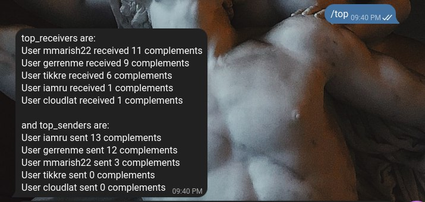
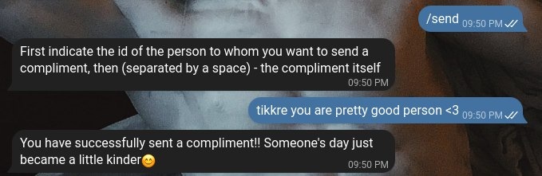
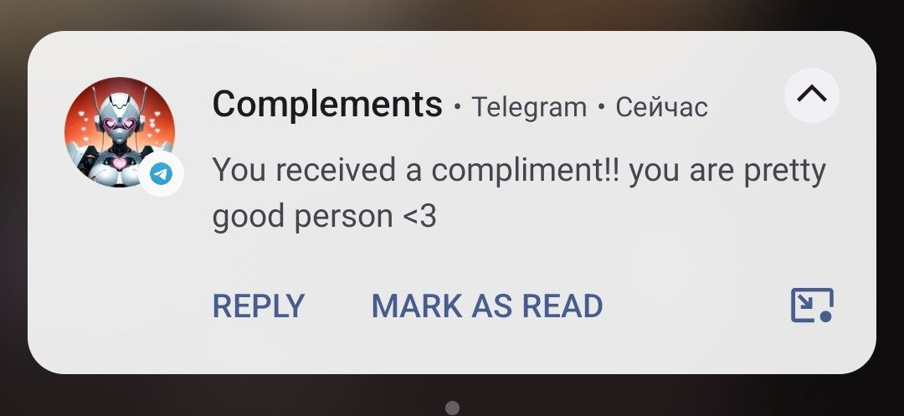

# "Compliment sender bot" for Telegram. v1.0

## What is the bot designed for?

* "Compliment sender bot" allows any user to send a random compliment to another random user. Users can also send anonymous compliments to other users than the username they know

* According to my idea, the bot should bring more joy and warmth into the lives of users, since they will often receive a random pleasant compliment that will brighten up their day a little. Especially for users who are afraid or embarrassed to give a compliment in person, there is a built-in function for anonymously sending a compliment

## What commands are available to the user?

* The following commands are available to a regular user:  

        /start - Registers the user in the system and allows access to the bot

        /help - Displays brief documentation about the provided commands
        
        /send - Allows a user to send an anonymous compliment to another user using username

        /random - Allows a user to send a random compliment generated by ChatGPT to another random user

        /stat - Displays statistics on the user's received and sent compliments

        /top - Displays the top 5 users among those who received and sent compliments

* The bot also provides special commands for administrators used to monitor the bot’s operation and force changes to the database

* The script also automatically logs various operations, such as user registration, sending a compliment, etc.

## Demo

### Registration in the bot

### Receiving complement

### View top users

### Sending a compliment

## TODO list

1. Create a bot base that responds to my messages ✅
2. Add user registration via PostgreSQL ✅
3. Add the ability for users to send compliments to other users ✅
4. Come up with several variations of sending compliments ✅
5. Add user statistics ✅
6. Add generation of random compliments via ChatGPT ✅
7. Figure out how you can limit the number of requests via asynchrony so that the API key does not burn out ✅
8. Add easy-to-read documentation ✅
9. Change the style of messages to be more attractive ✅
10. Come up with a cool design for the bot ✅
